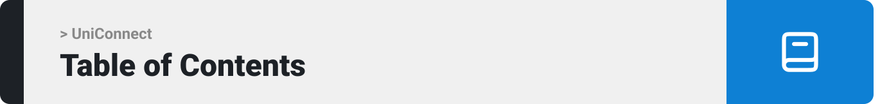

- [Project Philosophy](#project-description)
  - [User stories](#user-stories)
- [Prototyping](#prototyping)
- [Demo](#demo)
- [Tech Stack](#tech-stack)
- [How to Run](#how-to-run)
  - [Prerequisites](#prerequisites)
  - [Installation](#installation)

<br><br>

<!-- project philosophy -->
<a name="project-description"></a>


> A platform for different communities to come together and connect with each other. It offers a unique opportunity for individuals to explore new communities and connect with like-minded people
>
> UniConnect provides the ability for students with similar interests to connect and build relationships and aims to simplify the process of connecting with students and obtaining information about the ideas that users are interested in.

<a name="user-stories"></a>
### User Stories
- As a student, I want to create a private/public community so that I can share ideas and experiences.
- As a student, I want to join a community so that I can contact the community members.
- As a student, I want to chat with members so that I can learn and expand my knowledge.
- As a student, I want to chat with my friends so that I can build relationships.
- As a student, I want to add friends so that I can stay connected with people who I have met on the platform.

<br><br>

<!-- Prototyping -->
<a name="prototyping"></a>


> We developed UniConnect by creating wireframes and mockups, continuously refining the design to achieve an optimal layout that ensures effortless navigation and a smooth user experience.

### Mockups
| Login  | Signup | Private Conversation |
| ---| ---| ---|
|  |  |  |
###
| Community Conversation  | User Profile | Community Profile |
| ---| ---| ---|
|  |  |  |

<br><br>

<!-- Demo -->
<a name="demo"></a>


<br><br>

<!-- Tech stack -->
<a name="tech-stack"></a>


###  UniConnect is built using the following technologies:

- This project uses the MERN stack. The MERN stack is a full-stack web development framework consisting of MongoDB (database), Express.js (backend framework), React (frontend library), and Node.js (runtime environment). It is used to build scalable and efficient web applications.
- The project utilizes socket.io for real-time communication, ensuring seamless interactions with users.
- The styling was crafted using Tailwind CSS, ensuring a sleek and responsive user interface.
- The app uses the font ["Inter"](https://fonts.google.com/specimen/Inter) as its main font, and the design of the app adheres to the material design guidelines.

<br><br>

<!-- How to run -->
<a name="how-to-run"></a>


> To set up UniConnect locally, follow these steps:

### Prerequisites
<a name="prerequisites"></a>

* npm
  ```sh
  npm install npm@latest -g
  ```

### Installation
<a name="installation"></a>

1. Ensure you have Node.js installed. We recommend using the latest version available.
2. Clone the repo
   ```sh
   git clone https://github.com/mhmdhussein377/UniConnect.git
   ```
3. Install NPM packages
   ```sh
   cd client
   ```
   ```sh
   npm install
   ```
    ```sh
   cd server
   ```
   ```sh
   npm install
   ```
    ```sh
   cd socket
   ```
   ```sh
   npm install
   ```
4. Run the project
   ```sh
   cd client
   ```
   ```sh
   npm run dev
   ```

Now, you should be able to run UniConnect locally and explore its features.
